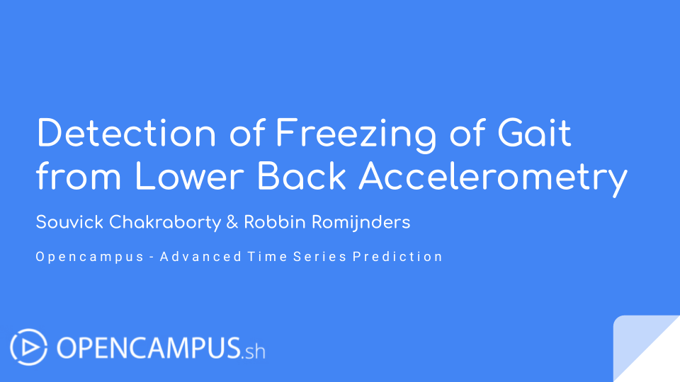

# Automated Detection of Freezing of Gait in Parkinson's Disease from Accelerometer Data

## Repository Link

[https://github.com/rmndrs89/advanced-time-series-prediction]

## Description

An estimated 7 to 10 million people around the world have Parkinson's disease (PD), many of whom suffer from freezing of gait (FOG). During a FOG episode, a patient's feet are _"glued"_ to the ground, preventing them from moving forward despite their attempts. FOG has a profound negative impact on health-related quality of life — people who suffer from FOG are often depressed, have an increased risk of falling, are likelier to be confined to wheelchair use, and have restricted independence.

While researchers have multiple theories to explain when, why, and in whom FOG occurs, there is still no clear understanding of its causes. The ability to objectively and accurately quantify FOG is one of the keys to advancing its understanding and treatment. There are many methods of evaluating FOG, though most involve laboratory-bound FOG-provoking protocols. People with FOG are filmed while performing certain tasks that are likely to increase its occurrence. Experts then review the video to score each frame, indicating when FOG occurred. While scoring in this manner is relatively reliable and sensitive, it is extremely time-consuming and requires specific expertise. Another method involves augmenting FOG-provoking testing with wearable devices, such as accelerometers attached to the lower back, which is more time efficient and potentially allows for capturing FOG in the home environment.

:bangbang: Therefore, the aim of the current study is to detect FOG from a lower back accelerometer.

### Task Type

The problem is framed as a time series **classification** problem, where the input features are 3D accelerometer data of shape $N_{\mathrm{win}} \times 3$, with $N_{\mathrm{win}}$ the length of the sliding window given by $T_{\mathrm{win}} \times f_{\mathrm{s}}$ (the duration of the window times the sampling frequency), and the outputs are 0 if no FOG is detected and 1 if FOG is detected.

### Results Summary

- **Best Model:** [Name of the best-performing model]
- **Evaluation Metric:** [e.g., Accuracy, F1-Score, MSE]
- **Result:** [e.g., 95% accuracy, F1-score of 0.8]

## Documentation

1. **[Literature Review](0_LiteratureReview/README.md)**
2. **[Dataset Characteristics](1_DatasetCharacteristics/exploratory_data_analysis.ipynb)**
3. **[Baseline Model](2_BaselineModel/baseline_model.ipynb)**
4. **[Model Definition and Evaluation](3_Model/model_definition_evaluation)**
5. **[Presentation](4_Presentation/README.md)**

## Cover Image

